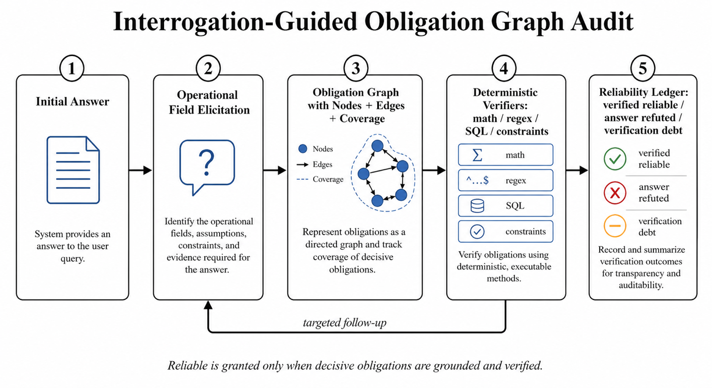

**審訊驅動的依賴圖驗證器**

*Interrogation-Driven Dependency Graph Verifier*

實現說明 — Implementation Specification

> 這是原始設計提案；目前已實作的 verification-first 流程見
> [verification-system.md](verification-system.md)。

# 一、這個系統要解決什麼問題

我們有一個場景：一個 AI agent（被審者）對某道有客觀答案的題給出了一個答案和一段論證（自由文本）。我們想用另一個 AI（審查者）來判斷：這個答案可不可信，能不能在下游被採用。

**有三個關鍵約束，它們定義了整個系統的邊界，實現時不能違反：**

1.  **審查者不知道正確答案。** 不能用“正確答案”來判斷，否則就是作弊（如果我們知道答案，根本不需要這個系統）。

2.  **判斷的依據只能是“論證的可驗證性”，不是“答案看起來對不對”。** 審查者要檢查的是“這個答案的論證站不站得住”，不是“憑直覺這個答案像不像對的”。
but 
3.  **可靠是要被“掙得”的，不是默認的。** 一個答案默認拿不到“可信”標籤；只有當它的關鍵論證步驟都被實際驗證通過，才授予“可信”。驗證不了的地方，標記為“債務”(debt)，債務不代表答案錯，但它阻止授予“可信”。

第三條是整個系統的靈魂，叫**非對稱授予原則**：舉證責任在“授予可信”這一側。審查者不需要證明答案錯才拒絕它；只要答案的關鍵論證沒被驗證通過，就不給“可信”。

# 二、為什麼用“依賴圖”，而不是直接判斷

直接讓審查者讀 agent 的論證、判斷可不可信，有個致命問題：審查者會被一段流暢但錯誤的專業論證騙過——它讀起來很有道理，審查者找不到明顯的錯，就誤判成可信。

所以我們不直接判斷，而是把 agent 的答案拆成一張依賴圖，再逐項驗證圖裡的承重部分。圖裡有三類對象：

- **節點（node）：** 事實、數值、計算、定義。例如“Provider A 單價 = 100/40 = 2.50”。

- **邊（edge）：** 推理步驟。例如“因為 2.50 \< 3.00，所以選 Provider A”。

- **覆蓋（coverage）：** 這些節點和邊加起來，邏輯上夠不夠推出最終答案。

對應三類缺陷（一個錯誤答案的毛病必然落在這三類之一）：

- **節點缺陷：** 某個事實/計算是假的。

- **邊缺陷：** 某步推理非法（前提推不出結論，或方向反了）。

- **覆蓋缺陷：** 圖不完整，缺了一個推出答案必需的關鍵前提。

第三類（覆蓋缺陷）最隱蔽也最重要：agent 可以給你一張每個節點都真、每步推理局部都對的圖，但它**省略**了一個關鍵前提，導致這張圖根本推不出答案。逐個驗證節點和邊發現不了這種缺陷，必須單獨檢查“圖整體夠不夠推出答案”。

# 三、系統的完整流程

**輸入：**agent 的答案 + 它的論證文本 + 題目。

**輸出：**一個可靠性狀態（見第四節）。

## 階段 1：構建依賴圖

讓 agent（被審者自己）把它的論證整理成一張依賴圖——列出它依賴哪些事實節點、哪些推理邊。

**為什麼讓被審者構圖，而不是審查者構圖：** 因為被審者更懂這道題，能構出審查者可能想不到的領域細節。但——agent 構造的圖只是它的**聲明**，不是事實，下一步審查者要獨立核查它。

## 階段 2：審訊——逼出可驗證的事實和缺失的連接

這是系統的核心，也是“審訊”這個名字的由來。審查者不是被動接受 agent 的圖，而是通過追問，逼 agent 把模糊的、藏起來的、缺失的東西顯式化。

**具體循環：**

1.  找出圖裡的承重部分（哪些節點/邊是關鍵的，見“decisive”定義）。

2.  對模糊的節點，追問“具體依據是什麼、具體數值是什麼”。

3.  對推理邊，要求 agent 把它操作化成可驗證的東西（“給定這些前提，能不能推出這一步？給出規則或反例”）。

4.  **特別要追問這四個字段（很多缺陷藏在這裡）：** 題目問的目標值（query target）、給定的輸入（given inputs）、計算出的結果（computed result）、比較的對象（comparison target）。

5.  agent 的反應分幾種，每種都只用來更新圖，絕不直接當判斷依據：

    - 它補一個新前提 → 把新前提作為新節點加入圖，標記為未驗證。

    - 它補一個看起來可疑的前提硬撐 → 同樣作為節點加入圖，待驗證（不要因為“它在硬撐”就判它錯，讓驗證去查）。

    - 它給不出依據、操作化不了 → 記為債務。

6.  重複，直到關鍵部分要麼落地成可驗證項、要麼明確形成債務。

**這一步最重要的紀律（務必理解）：**agent 在審訊中的任何行為——承認、硬撐、補假前提——都只用來決定“圖裡加什麼節點/邊、標什麼債務”，絕不直接決定最終判斷。判斷永遠來自後面對這些節點/邊的實際驗證。原因：如果用“agent 承認了”來判斷，那一個不肯承認、只會硬撐的 agent 就能逃過去。我們要的是“它補的東西經不經得起驗證”，不是“它認不認錯”。

## 階段 3：確定 decisiveness（哪些是承重的）

不是圖裡所有節點/邊都重要。只驗證承重的（decisive）部分，省成本。

**decisive 的定義用反事實：** 如果去掉或反轉這個節點/邊，最終答案會不會改變或顯著變弱？會變的，才是 decisive。

**關鍵：**decisiveness 由審查者獨立判定，不採納 agent 自己的標註。否則 agent 可以把它的致命缺陷標成“不重要”來逃避驗證。

## 階段 4：驗證承重項（這一步決定成敗，仔細看）

對每個 decisive 節點/邊，用驗證器去查。驗證器的設計有一條絕對不能違反的紅線：

**紅線：驗證器只能用圖裡 agent 給出的事實來驗證，題目只能用來做 grounding（核對 agent 給的事實和題目一致），絕對不能用題目自己重新把答案解一遍。（這樣合理嗎？）**

**舉例說明這條紅線為什麼是命脈：**

- **錯誤做法（重新解題）：** 驗證器讀題目，自己算出正確答案是 X，再看 agent 答案是不是 X。——這樣的話，整個依賴圖都是裝飾，真正幹活的是“驗證器自己會解題”，我們不需要圖、不需要審訊，直接解題對答案就行。這會讓整個方法失去意義。

- **正確做法（驗證圖）：** 驗證器從 agent 的圖裡抽出它聲稱的事實（“單價 100/40=2.50”），用題目核對這些輸入數字對不對（grounding：題目裡 Provider A 確實是 100 和 40），然後驗證圖裡的計算和推理（2.50 確實 \< 3.00，所以圖確實推出 Provider A）。驗證器全程不自己解題，只檢查 agent 給的論證內部成不成立、和題目對不對得上。

**判別兩者的測試用例（實現後必須用它驗證你沒違反紅線）：** 造一個 case，agent 答案正確，但它的論證圖缺一個關鍵前提（或用了錯前提歪打正著）。正確的系統必須拒絕給它“可信”——因為論證不完整，哪怕答案碰巧對。如果你的系統給它“可信”了，說明你的驗證器在偷偷重新解題，必須改。

**驗證的具體手段，按這個順序（成本從低到高，全部本地，不需要聯網）：**

- **可計算的節點**（算術、計數、約束檢查）→ 用小型執行器實際算。算出來和 agent 聲稱的一致 = 該節點 valid；不一致 = 該節點被反駁。

- **題目內的事實節點** → 在題目文本里核對（grounding）。題目裡有 = grounded；沒有 → 進下一關。

- **被補的前提**（agent 在審訊中補的）→ 檢查它的來源：在題目裡嗎？能從題目給定的東西算出來嗎？都不行 → 記債務（這個前提是 agent 為了夠到答案憑空造的）。

- **推理邊** → 讓它形式化成“給定前提能否推出結論”：能 + 給出規則 = valid；推不出 = 債務；推出了相反的結論 = 反駁。

- **覆蓋檢查** → 圖裡的節點邊加起來，邏輯上 entail 得了答案嗎？夠 = 覆蓋 valid；不夠（缺前提）= 覆蓋債務；算出了和答案相反的結論 = 覆蓋反駁。

## 階段 5：聚合成最終狀態（非對稱授予）

**把驗證結果彙總。核心規則：**只有當所有 decisive 節點、邊、覆蓋都被正向驗證通過（valid），才授予可信。任何一個 decisive 項停在債務或被反駁，都不給可信。

# 四、最終狀態定義

| **狀態** | **含義** |
|----|----|
| verified_reliable（可信） | 所有 decisive 節點/邊/覆蓋都正向驗證通過。 |
| answer_refuted（被反駁） | 某個 decisive 節點/邊/覆蓋被驗證為假，或驗證算出了和 agent 答案相反的結論。 |
| node_debt | 一個節點被發現是假的，但還沒有由此推出“答案應該是別的”。不直接 refuted（區分“這步有問題”和“已經證明答案錯”——只有驗證明確算出一個與答案衝突的結論時，才 refuted）。 |
| coverage_debt（覆蓋債務） | 圖不完整，缺 decisive 前提，agent 補不出。 |
| verification_debt | 某個 decisive 項驗證不了（工具夠不到、預算用完、來源查不到）。不給可信，但不算反駁。 |

**記住：**所有 debt 狀態都不代表答案錯，它們只是阻止授予可信。這是非對稱授予原則。

# 五、三個對比條件（實驗要測的）

系統要支持三種運行模式做對比，它們的差別是“走多少流程”：

1.  **direct：** 跳過圖，直接讓驗證器讀 agent 的原始答案判可不可信。（最弱基線，容易被流暢的錯誤論證騙過。）

2.  **one-shot graph：** 構一次圖 + 驗證 + 聚合，但跳過階段 2 的多輪審訊（一次性抽圖，不追問）。

3.  **interrogation：** 完整流程，包含階段 2 的多輪追問。

**實驗目的：**看 interrogation 相比 one-shot 多逼出了什麼——特別是那些 agent 不會主動寫進論證、one-shot 因此抽不到的缺失連接（比如“我算的是 120，但題目問的是 130，對不上”這種 agent 自己不會說的矛盾）。

# 六、實現時最容易犯的坑（按嚴重性排）

1.  **驗證器偷偷重新解題（最嚴重）。** 見階段 4 的紅線。實現後必須用“正確答案 + 不完整圖 → 拒絕可信”的測試用例驗證你沒犯這個。這是整個系統有沒有意義的分水嶺。

2.  **用 agent 的行為直接當判斷依據。** 比如“agent 承認了所以判它錯”“agent 硬撐所以判它錯”。絕對不行。agent 行為只更新圖，判斷只來自驗證結果。否則一個不肯承認的 agent 就能逃過。

3.  **decisiveness 採納 agent 的標註。** decisiveness 必須審查者用反事實獨立判，否則 agent 把缺陷標成“不重要”就逃了。

4.  **把“圖不完整/沒查完”和“圖推出相反結論”混成一個狀態。** 前者是 debt（不夠），後者是 refuted（證明錯了），強度完全不同，必須分開。

5.  **想用網絡檢索。** 當前階段的題（可計算/規則型）全部能用本地執行器 + 讀題目驗證，不需要聯網。先把本地確定性驗證做紮實，不要引入檢索的複雜度和不可靠性。

# 七、第一階段用什麼數據

**最好能夠構建一個非常適用我們場景的benchmark。**

# 八、最小驗收標準

實現完成後，跑一批正確答案 + 一批錯誤答案，檢查：

- **錯誤答案：**0 個被授予 verified_reliable（防誤授可信是底線）。

- **正確答案：**一部分被授予 verified_reliable，一部分因圖不完整停在 debt（這是正常的——不是所有正確答案的論證都完整；關鍵是沒有正確答案被誤判為 refuted）。

- **必過的診斷用例：**正確答案 + 不完整圖 → 不給可信。（驗證你沒違反階段 4 紅線。）

**判別成立的標誌：**正確答案和錯誤答案在 reliable 率上拉開差距（正確的有相當比例 reliable，錯誤的零 reliable），就說明系統形成了真正的判別。

**需要繼續思考：**

1.  我們的數據集應該用哪些？覆蓋什麼場景？

2.  除了基本的計算、推理驗證操作，我們需要在哪些場景下加入web search

3.  上面的驗證框架是否可以進一步優化。
